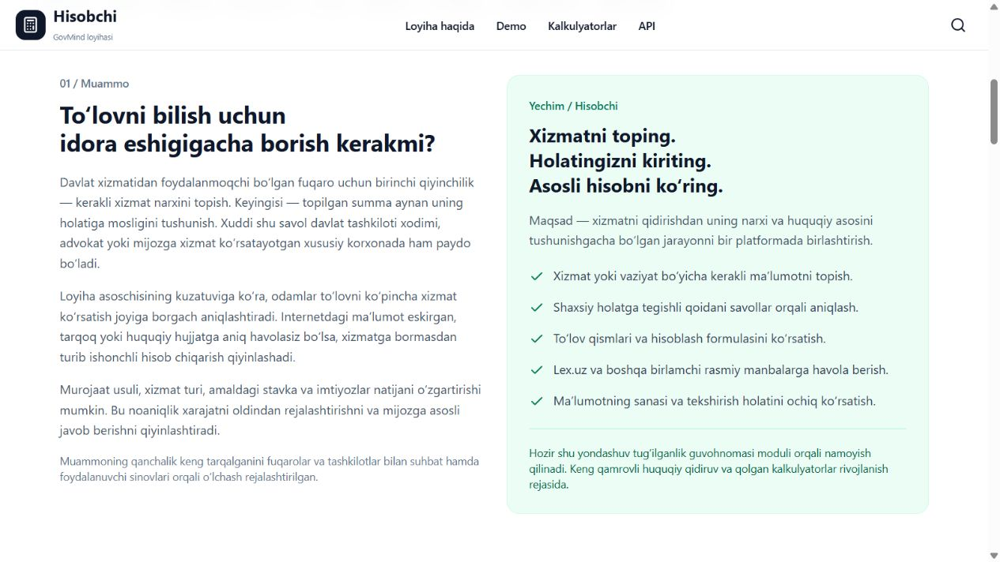

# Hisobchi — GovMind / Pitch Day 3.0

Davlat xizmatlari narxini topish, shaxsiy holatga mos hisoblash va huquqiy manbasini ko‘rish uchun yaratilayotgan qidiruv va hisoblash platformasi. Asoschi: Muhammadiso Jo‘rayev (GitHub: https://github.com/iso05). Loyiha papkasining texnik nomi GovCalc.

## Holat
Birinchi ishlaydigan modul: tug‘ilganlik guvohnomasi (GOV-001). Maqsad — davlat to‘lovlari bo‘yicha 45+ kalkulyator, keng huquqiy qidiruv, bepul va pullik imkoniyatlar hamda tashkilotlar uchun moslashtirilgan hisoblagichlarga oylik obuna. Bu kengayish rejalari; hozir tijoriy tariflar va to‘liq huquqiy qidiruv ishga tushmagan. Auditoriya: fuqarolar, davlat tashkilotlari, advokatlik tuzilmalari va xususiy xizmat ko‘rsatuvchi korxonalar. Lex.uz va my.gov.uz birlamchi manba havolalari sifatida ishlatiladi.

Ommaviy prototip: https://76.13.248.238/pitch

Hisoblash testlari matematik va dasturiy xulqni tekshiradi; huquqiy sertifikat emas. Barcha natijalarda huquqiy tekshiruv holati mavjud. 2026 demo BHM stavkasining farmoni va kuchga kirish sanasi qayta tekshirilishi kerak. Murakkab imtiyozlar ham ochiq masala.

## Ishga tushirish
Node.js 22 yoki undan yuqori; npm.

1. Repo ildizida: npm ci
2. Barcha paketlarni yig‘ish: npm run build
3. Sayt: npm run start --workspace=@govcalc/web
4. Ochish: http://localhost:3000/pitch

Saytning API yo‘llari Next.js ichida ishlaydi. Demo uchun PostgreSQL, Redis yoki alohida NestJS server talab qilinmaydi. NestJS alohida variant sifatida saqlangan: npm run start --workspace=@govcalc/api (4000-port).

Rivojlantirish: birinchi yig‘ishdan so‘ng npm run dev.

## Sahifalar
- / — mahsulot bosh sahifasi
- /pitch — musobaqa uchun muammo/yechim, jamoa, nega biz, roadmap, texnologiyalar va AI rejasi
- /demo — video uchun joy, demo tavsifi, prototip havolasi
- /api-access — ishlaydigan API hujjati
- /calculators/fhdyo-tugilganlik-guvohnomasi — kalkulyator

## Tekshiruv
- npm run test
- npm run typecheck (avval npm run build)
- npm run test:e2e --workspace=@govcalc/tests (production build talab qilinadi)

E2E testlari 390px mobil va 1280px desktop ko‘rinishlarini tekshiradi. Brauzer o‘rnatilmagan muhitda Playwright Chromium kerak bo‘ladi.

## Topshirishdan oldin
docs/DEPLOYMENT.md, docs/PITCH_DAY_CHECKLIST.md va docs/DEMO_SCRIPT.txt ni ko‘ring. Ommaviy HTTPS hosting va 4:36 davomiylikdagi demo-video tayyor: https://76.13.248.238/demo. Video VPSda alohida saqlanadi; katta media fayli Git tarixiga kiritilmagan.

